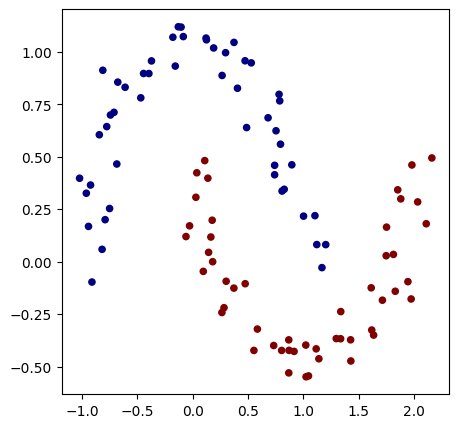
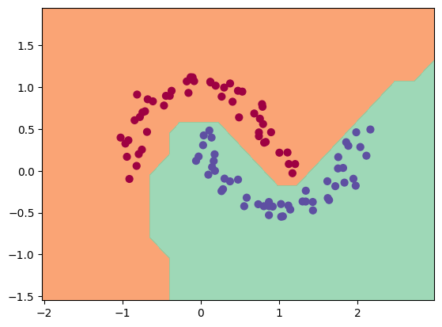
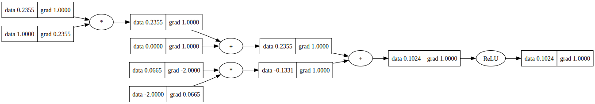

# DAGnet

A simple Autograd engine that implements backpropagation (reverse-mode autodiff) over a dynamically built DAG and a small neural networks library with a PyTorch-like API. The DAG only operates over scalar values. However, this is enough to build up entire deep neural nets doing binary classification, as the demo notebook shows.

> __NOTE__: __THIS PROJECT IS STILL UNDER DEVELOPMENT.__

> __DISCLAIMER__: _This is inspired by [pytorch's autograd engine](https://pytorch.org/blog/overview-of-pytorch-autograd-engine) as well as [micrograd](https://github.com/karpathy/micrograd) and used for experimenting with Phyton and the concept of autograd engines and neural nets._

<!-- ## Installation

```bash
pip install dagnet
```
-->
## Example usage

> __NOTE__: _Check out [demo.ipynb](demo.ipynb) for more detailed examples_

Below is a slightly contrived example showing a number of possible supported operations:

```python
from dagnet.engine import Value

a = Value(-4.0)
b = Value(2.0)
c = a + b
d = a * b + b**3
c += c + 1
c += 1 + c + (-a)
d += d * 2 + (b + a).relu()
d += 3 * d + (b - a).relu()
e = c - d
f = e**2
g = f / 2.0
g += 10.0 / f
print(f'{g.data:.4f}') # prints 24.7041, the outcome of this forward pass
g.backward()
print(f'{a.grad:.4f}') # prints 138.8338, i.e. the numerical value of dg/da
print(f'{b.grad:.4f}') # prints 645.5773, i.e. the numerical value of dg/db
```

## Training a neural net

The notebook `demo.ipynb` provides a full demo of training a 2-layer neural network (MLP) binary classifier. This is achieved by initializing a neural net from `dagnet.nn` module, implementing a simple svm "max-margin" binary classification loss and using SGD for optimization. As shown in the notebook, using a 2-layer neural net with two 16-node hidden layers we achieve the following decision boundary on the moon dataset:

| <a href="demo.ipynb"> | <a href="demo.ipynb"> |
|---|---|

## Tracing / visualization

For added convenience, the script `trace_graph.py` produces graphviz visualizations. E.g. this one below is of a simple 2D neuron, arrived at by calling `draw_dot` on the code below, and it shows both the data (left number in each node) and the gradient (right number in each node).

```python
from dagnet import nn
n = nn.Neuron(2)
x = [Value(1.0), Value(-2.0)]
y = n(x)
dot = draw_dot(y)
```



## Running tests

To run the unit tests you will have to install [PyTorch](https://pytorch.org/), which the tests use as a reference for verifying the correctness of the calculated gradients. Then simply run:

```bash
python -m pytest
```

## LICENSE

This project is licensed under the MIT license. See the [LICENSE](LICENSE) file for details.


---


© Carlo Bortolan

> Carlo Bortolan &nbsp;&middot;&nbsp;
> GitHub [carlobortolan](https://github.com/carlobortolan) &nbsp;&middot;&nbsp;
> contact via [carlobortolan@gmail.com](carlobortolan@gmail.com)
